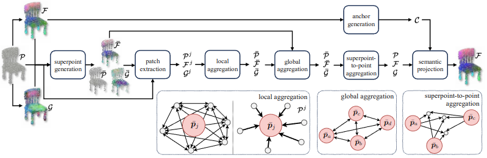

# GeoZe: Geometrically-driven Aggregation for Zero-shot 3D Point Cloud Understanding

Official implementation of [GeoZe](https://arxiv.org/abs/2312.02244).


[Guofeng Mei](https://gfmei.github.io/),  Luigi Riz, Yiming Wang, Fabio Poiesi

Technologies of Vision (TeV), Foundation Bruno Kessler &nbsp; &nbsp;

{gmei, luriz, ywang, poiesi}@fbk.eu

**CVPR 2024**
[Project Page](https://luigiriz.github.io/geoze-website/) | [Arxiv Paper](https://arxiv.org/abs/2312.02244)

## News
* We release the code for zero-shot 3D part segmentation 🔥.


## Introduction
We introduce the first training-free aggregation technique that leverages the point cloud’s 3D geometric structure to improve 
the quality of the transferred VLM representations. 



Our approach first clusters point cloud ${\mathcal{P}}$ into superpoints $\bar{{\mathcal{P}}}$ along with their 
associated geometric representation $\bar{{\mathcal{G}}}$, VLM representation $\bar{{\mathcal{F}}}$, and anchors ${{\mathcal{C}}}$. 
For each superpoint $\bar{{p}_j}$, we identify its $knn$ within the point cloud to form a patch ${\mathcal{P}}^j$ with their features ${\mathcal{G}}^j$ and ${\mathcal{F}}^j$.
For each patch, we perform a local feature aggregation to refine the VLM representations ${{\mathcal{F}}}$.
The superpoints then undergo a process of global aggregation. 
A global-to-local aggregation process is applied to update the per-point features.
Lastly, we employ the VLM feature anchors to further refine per-point features, which are then ready to be utilized for 
downstream tasks.

## Usage

### Installation
Prepare environment for part segmentation

'''bash

conda install pytorch==2.1.2 torchvision==0.16.2 torchaudio==2.1.2 pytorch-cuda=11.8 -c pytorch -c nvidia

pip install clip

'''

### Evaluation
 Part segmentation on ShapeNet

'''bash
python part_run.py --datasetpath Your shapenet data path
'''

## TODO
- [x] Provide code for part segmentation
- [ ] Provide code for shape classification 
- [ ] Provide code semantic segmentation
- [ ] Support in-webiste demo
- [ ] Provide code for nuScenes
- [ ] Support the latest PyTorch version

We are very much welcome all kinds of contributions to the project.

## Citation
If you find our code or paper useful, please cite
```bibtex
@inproceedings{mei2024geometrically,
  title     = {Geometrically-driven Aggregation for Zero-shot 3D Point Cloud Understanding},
  author    = {Mei, Guofeng and Riz, Luigi and Wang, Yiming and Poiesi, Fabio},
  booktitle = {Proceedings of the IEEE/CVF Conference on Computer Vision and Pattern Recognition (CVPR)},
  year      = {2024}
```