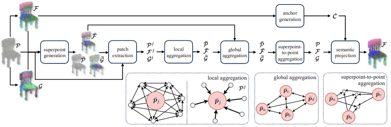

# Geometrically-driven Aggregation for Zero-shot 3D Point Cloud Understanding

Official implementation of [Geometrically-driven Aggregation for Zero-shot 3D Point Cloud Understanding (GeoZe)](https://arxiv.org/abs/2312.02244).

[Guofeng Mei](https://gfmei.github.io/),  [Luigi Riz](https://scholar.google.com/citations?user=djO2pVUAAAAJ), 
[Yiming Wang](https://scholar.google.com/citations?user=KBZ3zrEAAAAJ), 
[Fabio Poiesi](https://scholar.google.com/citations?user=BQ7li6AAAAAJ)

Technologies of Vision (TeV), Foundation Bruno Kessler &nbsp; &nbsp;

{gmei, luriz, ywang, poiesi}@fbk.eu

**CVPR 2024**
[Project Page](https://luigiriz.github.io/geoze-website/) | [Arxiv Paper](https://arxiv.org/abs/2312.02244)

## Demos

Two ways to see the method run, both documented end to end.

**Interactive scan viewer** — [`docs/`](docs/README.md) · GitHub Pages, static, nothing to keep alive.
Orbit a real ScanNet scan and switch between the raw scan, the ground truth, per-point VLM
predictions, region mean pooling, SemGeoZe v2, the merged partition itself, and an error map. Each
scene shows its own mIoU for all three methods.

```bash
python -m http.server 8000 --directory docs      # preview locally, then Settings -> Pages -> /docs
python semseg/export_demo.py --candidates 40     # regenerate the bundled scenes
```

**Live Space** — [`demo/`](demo/README.md) · HuggingFace Spaces, runs the real aggregation on CPU.
Drag `th_f` and watch regions merge. Set it to `1.00` and nothing merges: SemGeoZe v2 then scores
*exactly* the region-mean-pooling number, so the baseline can be checked rather than taken on
trust. Drop it to `0.85` and the region count collapses (2149 -> 499 on `scene0207_00`).

```bash
pip install -r demo/requirements.txt
python demo/pack_space_data.py --scenes scene0207_00 scene0583_02 scene0606_01 --voxel 0.06
cd demo && python app.py                         # http://127.0.0.1:7860
```

Deploying the Space needs `git lfs track "data/*.npz"` before the first commit — the bundled
scenes are ~62 MB. Full instructions in [`demo/README.md`](demo/README.md).

## News
* We release **SemGeoZe v2**, the scene-level pipeline for zero-shot semantic segmentation — **~26x faster** than GeoZe on ScanNet 🔥.
* We release the code for zero-shot 3D part segmentation 🔥.
* Our paper has been accepted by CVPR 2024 🔥.


## Introduction
We introduce the first training-free aggregation technique that leverages the point cloud’s 3D geometric structure to improve 
the quality of the transferred VLM representations. 



Our approach first clusters point cloud ${\mathcal{P}}$ into superpoints $\bar{{\mathcal{P}}}$ along with their 
associated geometric representation $\bar{{\mathcal{G}}}$, VLM representation $\bar{{\mathcal{F}}}$, and anchors ${{\mathcal{C}}}$. 
For each superpoint $\bar{{p}_j}$, we identify its $knn$ within the point cloud to form a patch ${\mathcal{P}}^j$ with their features ${\mathcal{G}}^j$ and ${\mathcal{F}}^j$.
For each patch, we perform a local feature aggregation to refine the VLM representations ${{\mathcal{F}}}$.
The superpoints then undergo a process of global aggregation. 
A global-to-local aggregation process is applied to update the per-point features.
Lastly, we employ the VLM feature anchors to further refine per-point features, which are then ready to be utilized for 
downstream tasks.

## SemGeoZe v2: geometrically-driven aggregation for scene semantic segmentation

Object-level GeoZe aggregates over a shape of a few thousand points. A room or a LiDAR scan is
two orders of magnitude larger, and Table 6 of the paper shows the cost: **2125.61 ms** per
ScanNet scene, because the pipeline builds $knn$ patches around every superpoint and runs
Sinkhorn attention inside each of them.

`semseg/` re-derives the aggregation for scenes — **ScanNet v2** (LSeg features, 20 classes) and
**nuScenes lidarseg** (OpenSeg features, 16 classes) — around a single idea:

> Aggregation may **enlarge** a region only when the enlargement is structurally justified, and it
> must never average across regions that stay separate.

Instead of attending within patches, we agglomerate the partition itself. Adjacent regions merge
in **mutual-best-match** pairs — no chaining — when they agree semantically ($\cos(z_m,z_n)\ge\theta_f$)
*and* geometrically (mean normal agreement and the boundary gate $b_{mn}\ge\theta_n$, measured on the
point pairs that actually straddle the two regions). Everything is a scatter-reduce over an edge
list, so the whole hierarchy costs one pass per round.

The neighbour graph is built by **multi-curve voting**: eight space-filling curves
({z, z-trans, Hilbert, Hilbert-trans} x {origin, half-cell shift}) each propose the pairs inside a
window of their sorted order, and a pair is kept only when several curves agree. A curve
discontinuity in one ordering essentially never lines up with one in another, so voting removes the
artefacts that make single-curve serialization lossy — while staying $O(N\log N)$ and entirely on
the GPU, with no KD-tree and no CPU round-trip.

### Inference time

Aggregation only (per-point features in -> refined per-point features out), one A100, 166k
points/scene, mean over 57 ScanNet scenes:

| method | ScanNet | speed-up |
|---|---|---|
| OpenScene [20] (paper Table 6) | 2088.72 ms | — |
| GeoZe (paper Table 6) | 2125.61 ms | 1.0x |
| **SemGeoZe v2**, KD-tree graph | **113.75 ms** | **18.7x** |
| **SemGeoZe v2**, multi-curve voting graph | **81.89 ms** | **25.9x** |

Breakdown for the voting variant: 38.98 ms graph + 42.91 ms aggregation. Swapping the exact
KD-tree for multi-curve voting nearly **halves** the graph cost (70.43 -> 38.98 ms) at equal
accuracy. On nuScenes (344k points/scan) the same pipeline runs in 173.50 ms.

*Caveat:* the two paper rows are quoted from Table 6 and were measured on the authors' hardware,
so the ratio is indicative rather than a controlled comparison. The algorithmic difference —
per-superpoint $knn$ patches plus Sinkhorn attention, versus scatter-reduces over one edge list —
is what the numbers reflect.

### Accuracy

The claim is **accuracy parity with plain region mean pooling of the same features, at a fraction
of the cost**. (There is no distillation anywhere in this pipeline — the baseline is simply
averaging the fused VLM features inside each region.)

**ScanNet v2 val** — all 312 scenes, LSeg features, mesh segments
&nbsp;·&nbsp; [details](semseg/README.md)

| | mIoU | mAcc | OA |
|---|---|---|---|
| per-point argmax | 0.4972 | 0.6346 | 0.7598 |
| region mean pooling (baseline) | 0.5564 | 0.6834 | 0.8147 |
| **SemGeoZe v2** | **0.5606** | **0.6856** | 0.8143 |

**nuScenes lidarseg val** — 301 scans, OpenSeg features, VCCS supervoxels
&nbsp;·&nbsp; [details](semseg/README_nuscenes.md)

| | mIoU | mAcc | OA |
|---|---|---|---|
| per-point argmax | 0.2882 | 0.4895 | 0.5079 |
| region mean pooling (baseline) | **0.2995** | 0.5150 | 0.6102 |
| SemGeoZe v2 (`th_f` 0.98) | 0.2995 | 0.5136 | 0.6103 |

SemGeoZe v2 improves the baseline by **+0.43 mIoU** on ScanNet and **reaches parity** on nuScenes,
while running ~26x faster than GeoZe's scene pipeline. The aggregation is what got cheap, not what
got more accurate — we state the gain as the small, reproducible number it is.

Two caveats a reader should have. ScanNet's mesh over-segmentation is *label-perfect* by
construction (annotators labelled those very segments, so oracle mIoU is exactly 1.000), and
pooling over the ground-truth region reaches only 0.6845 — most of the remaining gap is VLM/text
misalignment that no aggregation can close. On nuScenes, two setup choices matter far more than
the aggregation: the 43-label detail vocabulary (+8.5 mIoU over the 16 eval names) and using the
text tower the 2D backbone was aligned to. Per-stage ablations are in `semseg/out/`.

## Usage

### Installation

Part segmentation:

```bash
conda install pytorch==2.1.2 torchvision==0.16.2 torchaudio==2.1.2 pytorch-cuda=11.8 -c pytorch -c nvidia
pip install open-clip-torch==2.24.0
pip install open3d natsort matplotlib tqdm opencv-python scipy plyfile
```

Scene segmentation additionally needs `transformers` (for the CLIP text tower) and `scipy`;
`open3d` is used only by the ScanNet geometry pre-pass, and nuScenes needs neither it nor a GPU
pre-pass at all:

```bash
pip install transformers scipy open3d
```

The text tables are cached under `semseg/cache/` on first use. On an offline compute node,
pre-warm them from a node with network access:

```bash
python -c "from semseg.semmodel.post_search import search_prompt; \
           [search_prompt(d, only_evaluate=False) for d in ('scannet20','nuscenes16')]"
```

### Evaluation
 Part segmentation on ShapeNet

```bash
python part_run.py --datasetpath Your_shapenet_path
```

 Semantic segmentation — **ScanNet v2** ([docs](semseg/README.md))

```bash
# one-off geometry cache (normals + FPFH + VCCS), CPU, shardable
python semseg/sem_prep.py --shard 0 --nshards 12

python semseg/sem_run.py                           # SemGeoZe v2 on the val split
python semseg/sem_run.py --baseline meanpool       # region mean pooling, the baseline
python semseg/sem_run.py --curve                   # multi-curve voting graph (fastest)
python semseg/sem_run.py --part vccs               # VCCS partition, no mesh segments
```

 Semantic segmentation — **nuScenes lidarseg** ([docs](semseg/README_nuscenes.md))

```bash
# no pre-pass: normals are derived on GPU from the neighbour graph, supervoxels ship with the data
python semseg/sem_run.py --dataset nuscenes
python semseg/sem_run.py --dataset nuscenes --stride 20            # 301-scan subset, ~3 min
python semseg/sem_run.py --dataset nuscenes --baseline meanpool
```

 Benchmarks and probes

```bash
python semseg/bench_speed.py --dataset scannet     # reproduce the timing table
python semseg/probe_vocab.py                       # nuScenes label-set / prompt ablation
```

Dataset paths default to the OpenScene layout and are set at the top of
[`semseg/scannet.py`](semseg/scannet.py) and [`semseg/nuscenes.py`](semseg/nuscenes.py):

```
scannet_3d/{train,val}/<scene>_vh_clean_2.pth      coords, colours, labels
scannet_lseg_teacher/<scene>.pth                   fused LSeg features (512-d)
nuscenes_3d/val/<scene>.pth  + <scene>_spt.npy     coords, labels, VCCS supervoxels
nuscenes_multiview_openseg_val/<scene>.pt          fused OpenSeg features (768-d)
```

## TODO
- [x] Provide code for part segmentation
- [x] Provide code for scene semantic segmentation ([ScanNet](semseg/README.md), [nuScenes](semseg/README_nuscenes.md))
- [x] Support in-website demo (GitHub Pages viewer + HuggingFace Space)

We are very much welcome all kinds of contributions to the project.

## Contributors

The original GeoZe (CVPR 2024) is by Guofeng Mei, Luigi Riz, Yiming Wang and Fabio Poiesi.

**SemGeoZe v2** (`semseg/`, `docs/`, `demo/`) was designed by
[Guofeng Mei](https://gfmei.github.io/): the VCCS-guided parameter-free aggregation for scenes,
the space-filling-curve serialization that replaces the KD-tree, and the multi-curve voting
neighbour graph that makes it both cheaper and more accurate than exact kNN. The implementation,
the evaluation harness and the ablations were produced with AI assistance (Claude Opus 4.8),
including the adjacency-constrained hierarchical merging that the measurements converged on.

## Citation
If you find our code or paper useful, please cite
```bibtex
@inproceedings{mei2024geometrically,
  title     = {Geometrically-driven Aggregation for Zero-shot 3D Point Cloud Understanding},
  author    = {Mei, Guofeng and Riz, Luigi and Wang, Yiming and Poiesi, Fabio},
  booktitle = {Proceedings of the IEEE/CVF Conference on Computer Vision and Pattern Recognition (CVPR)},
  year      = {2024}
```

## Acknowledgement

This repo benefits from [PointCLIPV2](https://github.com/yangyangyang127/PointCLIP_V2), [CLIP](https://github.com/openai/CLIP), 
and [OpenScene](https://github.com/pengsongyou/openscene). Thanks for their wonderful works.