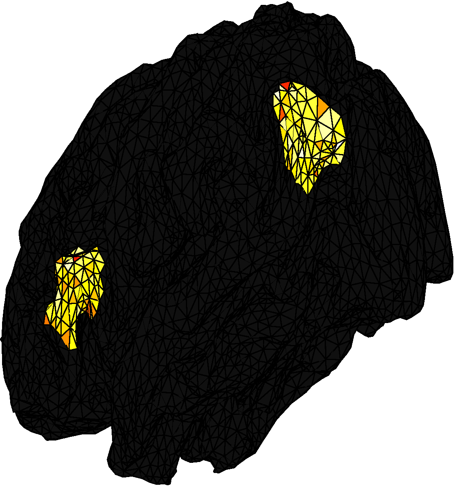
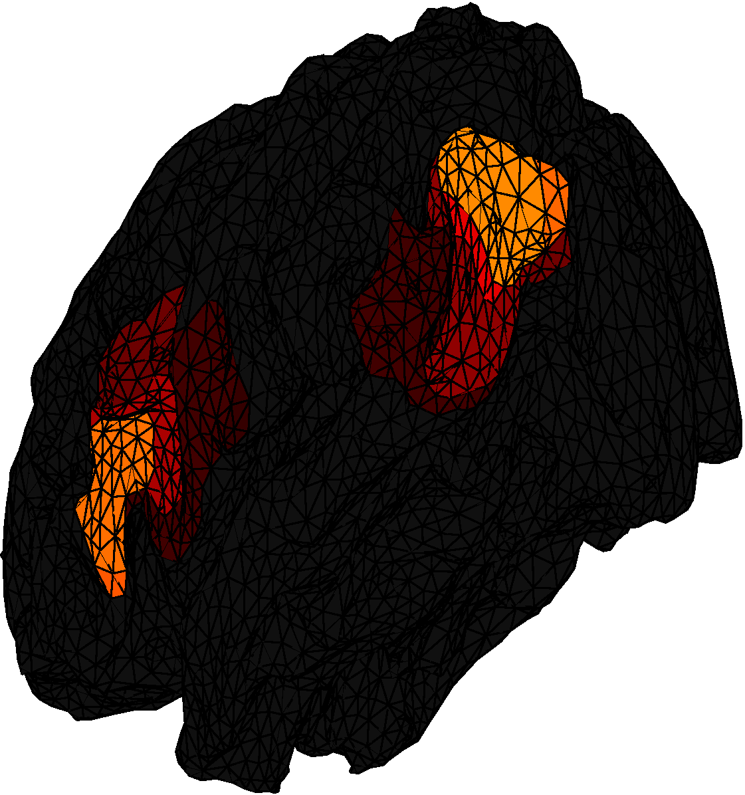
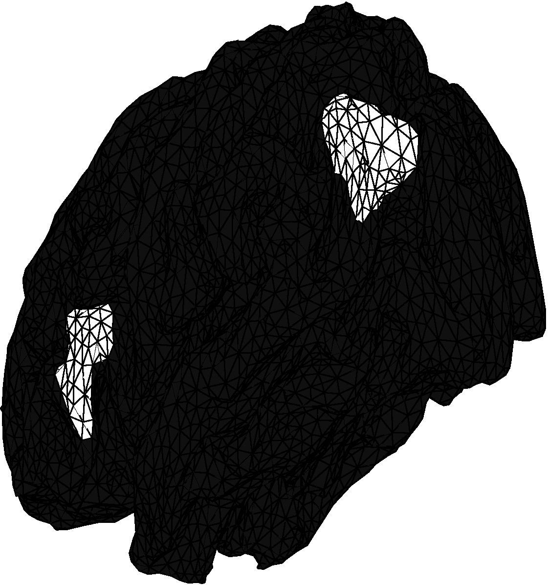
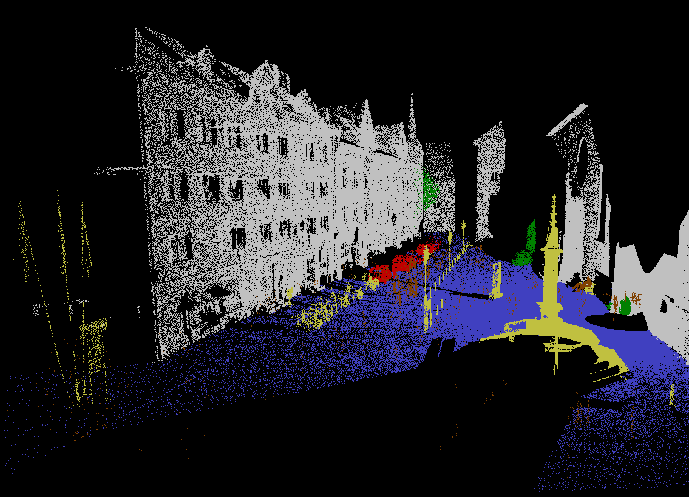
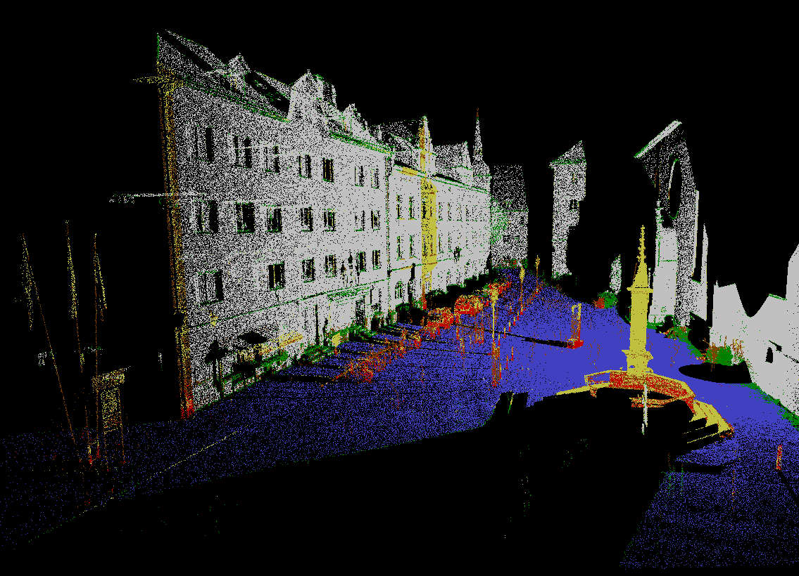
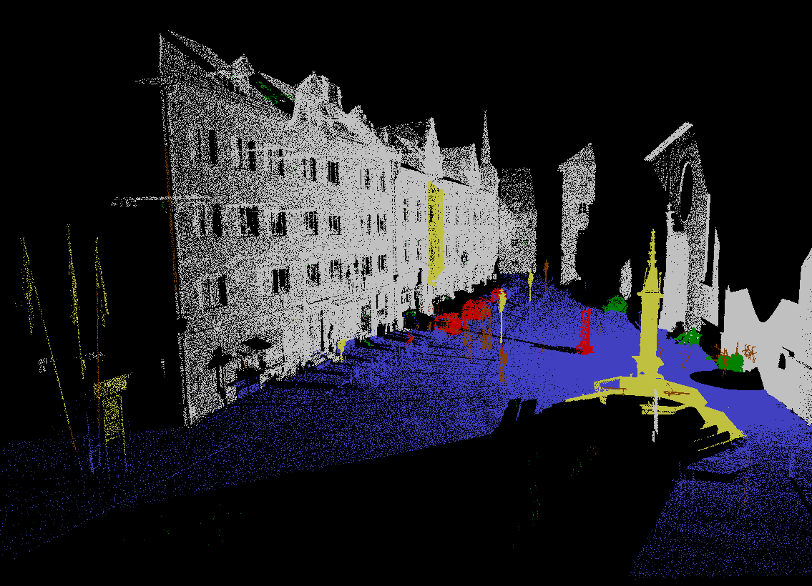

# Preconditioned Proximal Splitting Algorithms

Generic C++ classes for implementing preconditioned proximal splitting algorithms.  
Specialization to preconditioned generalized forward-backward or forward-Douglas–Rachford proximal splitting algorithms, on problems involving **graph total variation**, as explained in our articles [(Raguet and Landrieu, 2015; Raguet, 2018)](#references).  
Parallel implementation with OpenMP.  
MEX interfaces for GNU Octave or Matlab.  
Extension modules for Python.  

## Table of Content  

1. [**C++ classes and Specializations**](#c-classes-pecializations)  
1.1. [Proximity operator of the graph total variation](#pfdr_prox_tv-proximity-operator-of-the-graph-total-variation)  
1.2. [Quadratic functional and graph total variation](#pfdr_d1_ql1b-quadratic-functional-ℓ1-norm-bounds-and-graph-total-variation)  
1.3. [Separable multidimensional loss and graph total variation](#pfdr_d1_lsx-separable-loss-simplex-constraints-and-graph-total-variation)  
2. [**Documentation**](#documentation)  
2.1. [Directory tree](#directory-tree)  
2.2. [Graph structure](#graph-structure)  
2.3. [C++ documentation](#c-documentation)  
2.4. [GNU Octave or Matlab](#gnu-octave-or-matlab)  
2.5. [Python](#python)  
3. [**References**](#references)  
4. [**License**](#license)  

## C++ classes and Specializations

The module `pcd-prox-split` implements the base class `Pcd_prox`, with minimalist structure for a preconditioned proximal splitting algorithm.  

The module `pcd_fwd_doug_rach` implements the class `Pfdr` derived from `Pcd_prox`, for the preconditioned generalized forward-backward or forward-Douglas–Rachford proximal splitting algorithms: introduces preconditioner <i>Γ</i>, weights <i>W</i>, Lipschitz metric <i>L</i>.  

The module `pfdr_graph_d1` implements the class `Pfdr_d1` derived from `Pfdr`, specializing data structures for minimizing functionals penalized by the graph total variation: given a weighted graph <i>G</i> = (<i>V</i>, <i>E</i>), it reads  

<i>F</i>: <i>x</i> ∈ ℝ<i>D</i>⨯<i>V</i> ↦
    <i>f</i>(<i>x</i>) + 
    ∑(<i>u</i>,<i>v</i>) ∈ <i>E</i> <i>w</i>(<i>u</i>,<i>v</i>)
║<i>x</i><i>u</i> − <i>x</i><i>v</i>║<i>p</i>, <i>M</i>δ +
    <i>h</i>(<i>x</i>) ,  

where
<i>D</i> is the dimension of the signal on each vertex,
<i>f</i> is a convex smooth functional,
<i>h</i> is a convex nonsmooth functional,
<i>w</i> ∈ ℝ<i>E</i> are regularization weights,
and the norm on the finite differences is defined by <i>p</i> being 1 or 2 and a weighting diagonal metric <i>M</i>δ.

### `Pfdr_prox_tv`: proximity operator of the graph total variation
Also coined “graph total variation denoising” or “general fused LASSO signal approximation”. The dimension <i>D</i> can be arbitrary, <i>h</i> is 0, and

<i>f</i>: <i>x</i> ∈ ℝ<i>D</i>⨯<i>V</i> ↦
    1/2 ║<i>y</i> − <i>x</i>║<i>M</i>ℓ2

where <i>y</i> ∈ ℝ<i>D</i>⨯<i>V</i> and <i>M</i>ℓ is a diagonal weighting metric.  

### `Pfdr_d1_ql1b`: quadratic functional, ℓ1 norm, bounds, and graph total variation
The dimension <i>D</i> is 1, and

<i>f</i>: <i>x</i> ∈ ℝ<i>V</i> ↦ 
    1/2 ║<i>y</i>(ℓ2) − <i>A</i><i>x</i>║2  

where

<i>y</i>(ℓ2) ∈ ℝ<i>n</i>, 
<i>A</i>: ℝ<i>V</i> → ℝ<i>n</i> is a linear operator, and  

<i>h</i>: <i>x</i> ∈ ℝ<i>V</i> ↦ 
    ∑<i>v</i> ∈ <i>V</i> <i>λ</i><i>v</i>
        |<i>y</i>(ℓ1) − <i>x</i><i>v</i>| +
    ∑<i>v</i> ∈ <i>V</i>
<i>ι</i>[<i>m</i><i>v</i>, <i>M</i><i>v</i>](<i>x</i><i>v</i>)   
                 +
∑(<i>u</i>,<i>v</i>) ∈ <i>E</i> <i>w</i>(<i>u</i>,<i>v</i>)
|<i>x</i><i>u</i> − <i>x</i><i>v</i>| ,   

where
<i>λ</i> ∈ ℝ<i>V</i> are regularization weights, 
<i>m</i>, <i>M</i> ∈ ℝ<i>V</i> are parameters and 
<i>ι</i>[<i>a</i>,<i>b</i>] is the convex indicator of [<i>a</i>, <i>b</i>]: x ↦ 0 if <i>x</i> ∈ [<i>a</i>, <i>b</i>], +∞ otherwise.  

When <i>y</i>(ℓ1) is zero, the combination of ℓ1 norm and total variation is sometimes coined _fused LASSO_.  

When <i>A</i> is the identity, _λ_ is zero and there are no box constraints, the problem boils down to [the proximity operator of the graph total variation](#pfdr_prox_tv-proximity-operator-of-the-graph-total-variation).  

Currently, <i>A</i> must be provided as a matrix. See the documentation for special cases.  

An example with [GNU Octave or Matlab](#gnu-octave-or-matlab) and [Python](#python) interfaces, where <i>A</i> is a full ill-conditioned matrix, with positivity and fused LASSO constraints, on a task of _brain source identification from electroencephalography_.  

<table><tr>
<td width="10%"></td>
<td width="20%"> ground truth </td>
<td width="10%"></td>
<td width="20%"> raw retrieved activity </td>
<td width="10%"></td>
<td width="20%"> identified sources </td>
<td width="10%"></td>
</tr><tr>
<td width="10%"></td>
<td width="20%"></td>
<td width="10%"></td>
<td width="20%"></td>
<td width="10%"></td>
<td width="20%"></td>
<td width="10%"></td>
</tr></table>

### `Pfdr_d1_lsx`: separable loss, simplex constraints, and graph total variation
The dimension <i>D</i> is (the size of) a set of labels, <i>x</i> lies on the standard simplex, the norm on the finite difference is a ℓ1-norm (<i>p</i> = 1), and <i>f</i> a loss separable along vertices.

<i>f</i>: <i>x</i> ∈ ℝ<i>D</i>⨯<i>V</i> ↦  <i>f</i>(<i>y</i>, <i>x</i>)  

where <i>y</i> ∈ ℝ<i>D</i>⨯<i>V</i>, <i>f</i> is a loss functional (see below),   

<i>h</i>: ∑<i>v</i> ∈ <i>V</i>
    <i>ι</i>Δ<i>D</i>(<i>x</i><i>v</i>)

where <i>ι</i>Δ<i>D</i> is the convex indicator of the simplex
Δ<i>D</i> = {<i>x</i> ∈ ℝ<i>D</i> | ∑<i>d</i> <i>x</i><i>d</i> = 1 and ∀ <i>d</i>, <i>x</i><i>d</i> ≥ 0}: <i>x</i> ↦ 0 if <i>x</i> ∈ Δ<i>D</i>, +∞ otherwise.  

The following loss functionals are available, where <i>w</i>(<i>f</i>) ∈ ℝ<i>V</i> are weights on vertices.  
Linear: <i>f</i>(<i>y</i>, <i>x</i>) = − ∑<i>v</i> ∈ <i>V</i> <i>w</i>(<i>f</i>)<i>v</i> ∑<i>d</i> ∈ <i>D</i> <i>x</i><i>v</i>,<i>d</i> <i>y</i><i>v</i>,<i>d</i>  
Quadratic: <i>f</i>(<i>y</i>, <i>x</i>) = ∑<i>v</i> ∈ <i>V</i> <i>w</i>(<i>f</i>)<i>v</i> ∑<i>d</i> ∈ <i>D</i> (<i>x</i><i>v</i>,<i>d</i> − <i>y</i><i>v</i>,<i>d</i>)2  
Smoothed Kullback–Leibler divergence (equivalent to cross-entropy):  
<i>f</i>(<i>y</i>, <i>x</i>) = ∑<i>v</i> ∈ <i>V</i> <i>w</i>(<i>f</i>)<i>v</i>
KL(<i>α</i> <i>u</i> + (1 − <i>α</i>) <i>y</i><i>v</i>, <i>α</i> <i>u</i> + (1 − <i>α</i>) <i>x</i><i>v</i>),  
where <i>α</i> ∈ \]0,1\[,
<i>u</i> ∈ Δ<i>D</i> is the uniform discrete distribution over <i>D</i>,
and  
KL: (<i>p</i>, <i>q</i>) ↦ ∑<i>d</i> ∈ <i>D</i> <i>p</i><i>d</i> log(<i>p</i><i>d</i>/<i>q</i><i>d</i>).  

An example with the smoothed Kullback–Leibler is provided with [GNU Octave or Matlab](#gnu-octave-or-matlab) and [Python](#python) interfaces, on a task of _spatial regularization of semantic classification of a 3D point cloud_.  

<table><tr>
<td width="5%"></td>
<td width="25%"> ground truth </td>
<td width="5%"></td>
<td width="25%"> random forest classifier </td>
<td width="5%"></td>
<td width="25%"> regularized classification </td>
<td width="5%"></td>
</tr><tr>
<td width="5%"></td>
<td width="25%"></td>
<td width="5%"></td>
<td width="25%"></td>
<td width="5%"></td>
<td width="25%"></td>
<td width="5%"></td>
</tr></table>

## Documentation

### Directory tree
    .   
    ├── data/         various data for illustration  
    ├── grid-graph/   git submodule for graph representation of grids  
    │                   (necessary only for prox tv example)  
    ├── matrix-tools/ git submodule for matrix manipulations  
    │                   (necessary only for pfdr_d1_ql1b)  
    ├── include/      C++ headers, with some doc  
    ├── octave/       GNU Octave or Matlab code  
    │   ├── doc/      some documentation  
    │   └── mex/      MEX C++ interfaces  
    ├── proj-simplex/ git submodule for projection on simplex  
    │                   (necessary only for pfdr_d1_lsx)  
    ├── python/       Python code  
    │   ├── cpython/  C Python interfaces  
    │   └── wrappers/ python wrappers and documentation  
    └── src/          C++ sources  

### C++ documentation
Requires `C++11`.  
Be sure to have OpenMP enabled with your compiler to enjoy parallelization. Note that, as of 2020, MSVC still does not support OpenMP 3.0 (published in 2008); consider switching to a decent compiler.  

The number of parallel threads used in parallel regions is crucial for good performance; it is roughly controlled by a macro `MIN_OPS_PER_THREAD` which can be set by usual `D` compilation flag. A rule of thumb is to set it to `10000` on personnal computers with a handful of cores, and up to `100000` for large computer clusters with tens of cores.  

The C++ classes are roughly documented within the corresponding headers in `include/`.  

### Graph structure
Graph structures must be given as an adjacency list, that is as arrays specifying start en end vertices contiguously. For creation from scratch for regular N-dimensionnal grids (2D for images, 3D for volumes, etc.), see the `grid-graph` git submodule.  

### GNU Octave or Matlab
See the script `compile_pcd_prox_split_mex.m` for typical compilation commands; it can be run directly from the GNU Octave interpreter, but Matlab users must set compilation flags directly on the command line `CXXFLAGS = ...` and `LDFLAGS = ...`.  

Extensive documention of the MEX interfaces can be found within dedicated `.m` files in `octave/doc/`.  

The script `example_prox_tv.m` exemplifies the use of [`Cp_prox_tv`](#cp_prox_tv-proximity-operator-of-the-graph-total-variation), on a task of _color image denoising_.  

The script `example_EEG.m` exemplifies the use of [`Cp_d1_ql1b`](#cp_d1_ql1b-quadratic-functional-ℓ1-norm-bounds-and-graph-total-variation), on a task of _brain source identification from electroencephalography_.  

The script `example_labeling_3D.m` exemplifies the use of [`Cp_d1_lsx`](#cp_d1_lsx-separable-loss-simplex-constraints-and-graph-total-variation), on a task of _spatial regularization of semantic classification of a 3D point cloud_.  

### Python
Requires `numpy` package.  
See the script `setup.py` for compiling modules with `distutils`; on UNIX systems, it can be directly interpreted as `python setup.py build_ext`.  

Extensive documention of the Python wrappers can be found in the corresponding `.py` files.  

The script `example_prox_tv.py` exemplifies the use of [`Cp_prox_tv`](#cp_prox_tv-proximity-operator-of-the-graph-total-variation), on a task of _color image denoising_.  

The script `example_EEG.py` exemplifies the use of [`Cp_d1_ql1b`](#cp_d1_ql1b-quadratic-functional-ℓ1-norm-bounds-and-graph-total-variation), on a task of _brain source identification from electroencephalography_.  

The script `example_labeling_3D.py`exemplify the use of [`Cp_d1_lsx`](#cp_d1_lsx-separable-loss-simplex-constraints-and-graph-total-variation), on a task of _spatial regularization of semantic classification of a 3D point cloud_.  

## References
H. Raguet and L. Landrieu, [Preconditioning of a Generalized Forward-Backward Splitting and Application to Optimization on Graphs](https://1a7r0ch3.github.io/pgfb/), 2015.

H. Raguet, [A Note on the Forward-Douglas-Rachford Splitting Algorithm for Monotone Inclusion and Convex Optimization](https://1a7r0ch3.github.io/fdr/), 2018.

## Licence
This software is under the GPLv3 license.
